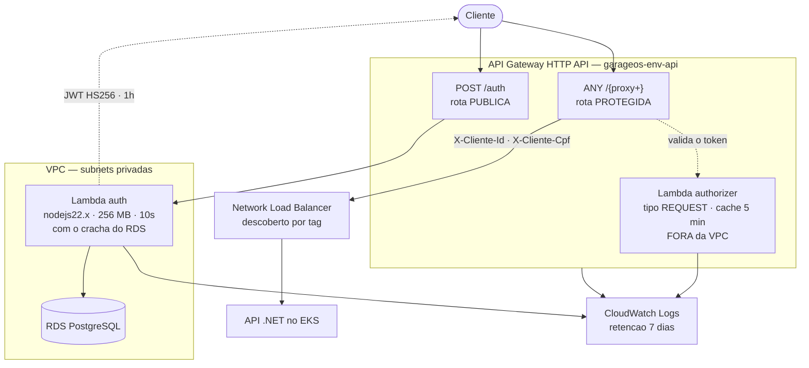
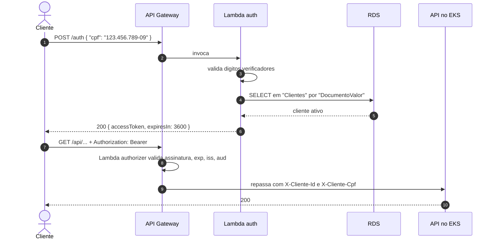

# garageos-lambda-auth

Autenticação por **CPF** do GarageOS em AWS Lambda, e o **API Gateway HTTP API** que é a porta de entrada da solução.

> Um dos quatro repositórios do Tech Challenge — Fase 3. É o **último** a ser aplicado: ele descobre o Load Balancer criado pela aplicação.

---

## O que este repositório provisiona



| Arquivo | Recursos |
|---|---|
| `lambda.tf` | Empacotamento do código, IAM Role, as **duas** funções Lambda e os log groups |
| `apigateway.tf` | HTTP API, authorizer, integrações, rotas, permissões e stage `$default` |
| `data.tf` | Descoberta da VPC, do crachá do RDS, dos segredos e do Load Balancer |
| `lambda/index.mjs` | Código das duas funções |

Decisões de projeto: [RFC 0003 — Estratégia de Autenticação](https://github.com/TechChallengeFase1/garageos-app/blob/main/docs/rfcs/0003-estrategia-de-autenticacao.md).

---

## As duas funções

| Função | Handler | VPC | Papel |
|---|---|---|---|
| `garageos-<env>-auth` | `index.handler` | **Dentro**, subnets privadas, com o crachá do RDS | Valida o CPF, consulta o cliente e emite o JWT |
| `garageos-<env>-authorizer` | `index.authorizer` | **Fora** | Confere a assinatura do token antes de a requisição chegar ao cluster |

O authorizer fica fora da VPC de propósito: ele só confere uma assinatura HMAC, não toca no banco. Sem ENI para criar, o cold start é muito menor — e ele roda em **toda** requisição protegida.

Ambas saem do mesmo arquivo e do mesmo zip: são dois handlers exportados, não dois projetos.

---

## Fluxo de autenticação



| Situação | Resposta |
|---|---|
| CPF com formato ou dígitos verificadores inválidos | `400` |
| Cliente não encontrado | `404` |
| Cliente inativo | `403` |
| Banco indisponível | `503` |
| Token ausente, inválido ou expirado (rota protegida) | `401`, **sem chegar ao cluster** |

Diagrama detalhado: [sequência de autenticação](https://github.com/TechChallengeFase1/garageos-app/blob/main/docs/diagramas/sequencia-autenticacao.md).

---

## Decisões que valem conhecer antes de mexer

**Authorizer do tipo REQUEST, não JWT nativo.** O HTTP API tem um authorizer JWT pronto, mas ele exige um provedor OIDC/OAuth2 que exponha JWKS — Cognito, Auth0 e afins. Nosso token é HS256, assinado com chave simétrica: não existe chave pública para o gateway buscar. Por isso a validação roda numa Lambda própria.

**Node.js, não .NET.** Cold start de ~200 ms contra 1 a 2 segundos sem Native AOT. Numa autenticação, essa é a diferença entre o login parecer instantâneo ou travado. O HS256 é idêntico nas duas linguagens, então a API .NET valida o token sem saber quem o assinou.

**Uma dependência só (`pg`).** O JWT é assinado com o módulo `crypto` do próprio Node — HS256 é um HMAC-SHA256 sobre `"cabeçalho.corpo"`, e trazer uma biblioteca só para isso não se justifica.

**Segredos injetados no apply, não lidos em runtime.** A Lambda fica em subnet privada e o bootstrap não criou NAT Gateway (economia de ~US$ 32/mês). Sem rota para a internet, ela não alcançaria a API do Secrets Manager. As alternativas seriam um VPC endpoint de interface (~US$ 14/mês) ou o NAT. A fonte da verdade continua sendo o cofre; muda apenas *quando* o valor é lido.

**A mesma `JWT_SECRET_KEY` da API.** Lambda e API leem do mesmo segredo (`garageos/app/secrets`). Se divergirem, a API rejeita silenciosamente **todo** token emitido aqui — sem erro claro, sem log útil, só 401 em tudo.

**`crypto.timingSafeEqual` na verificação.** Uma comparação com `===` sai no primeiro byte diferente, e medir esse tempo permite descobrir a assinatura byte a byte.

**Trade-off aceito: o NLB é `internet-facing`.** A aplicação continua acessível diretamente, sem passar pelo gateway. A alternativa correta seria um NLB interno com VPC Link. A API .NET valida o token por conta própria, o que reduz o impacto.

---

## Como executar

### Pré-requisitos

Toda a cadeia anterior aplicada, **nesta ordem**:

```text
bootstrap/  →  garageos-infra-database  →  garageos-infra-k8s  →  garageos-app  →  garageos-lambda-auth
```

A aplicação precisa estar implantada **e com o Load Balancer criado**: o `data "aws_lb"` o descobre pela tag `kubernetes.io/service-name`, e o `plan` falha se ele ainda não existir.

```bash
kubectl get svc garageos-api -n garageos
```

### Deploy automático (caminho normal)

| Gatilho | Ação |
|---|---|
| Pull Request para `homolog` ou `main` | `fmt` + `validate` + `plan` |
| Push em `homolog` | `apply` no workspace `homolog` |
| Push em `main` | `apply` no workspace `producao` |
| `workflow_dispatch` | `plan`, `apply` ou `destroy` no ambiente escolhido |

Autenticação por **OIDC**, sem credencial estática da AWS neste repositório.

### Execução local

```bash
terraform init
```

```bash
terraform workspace select -or-create producao
```

```bash
terraform apply
```

O zip é montado pelo provider `archive` a partir do diretório `lambda/`. Se você alterar dependências, rode `npm install` dentro de `lambda/` antes do apply — o que estiver em `lambda/node_modules` entra no pacote.

### Testar o fluxo completo

```bash
terraform output -raw como_testar
```

O output imprime os três comandos prontos. Em resumo:

```bash
curl -X POST "$(terraform output -raw api_gateway_url)/auth" -H "content-type: application/json" -d '{"cpf":"SEU_CPF_CADASTRADO"}'
```

```bash
curl "$(terraform output -raw api_gateway_url)/api/Clientes" -H "Authorization: Bearer SEU_TOKEN"
```

```bash
curl -i "$(terraform output -raw api_gateway_url)/api/Clientes"
```

O terceiro deve retornar **401** — é a prova de que a rota protegida barra quem não tem token.

### Destruir

```bash
terraform destroy
```

Lambda e API Gateway custam praticamente nada parados (cobrança por invocação), então este é o repositório menos urgente de destruir. Ainda assim, destrua-o **antes** do cluster: ele depende do Load Balancer.

---

## Outputs

| Output | O que traz |
|---|---|
| `api_gateway_url` | URL base da solução — a porta de entrada |
| `endpoint_autenticacao` | Onde obter o token informando o CPF |
| `load_balancer_destino` | Load Balancer descoberto por tag |
| `como_testar` | Fluxo completo em três comandos |

### Diagnóstico

```bash
aws logs tail /aws/lambda/garageos-producao-auth --follow
```

```bash
aws logs tail /aws/apigateway/garageos-producao --follow
```

O log de acesso do gateway registra `authorizerErro` e `integracaoErro` — é por onde se descobre **por que** uma requisição foi recusada.

---

## Configuração

| Variável | Padrão | Observação |
|---|---|---|
| `aws_region` | `us-east-1` | A mesma do resto do projeto |
| `namespace` | `garageos` | Usado para achar o Load Balancer pela tag |
| `service_name` | `garageos-api` | Nome do Service no Kubernetes |
| `jwt_expires_in_seconds` | `3600` | Validade do token emitido |
| `lambda_runtime` | `nodejs22.x` | Ver decisões acima |

Proteções do stage: `throttling_burst_limit = 100` e `throttling_rate_limit = 50` — o controle de chamadas que o enunciado cita entre as funções do API Gateway.

---

## Estrutura

```text
garageos-lambda-auth/
├── lambda/
│   ├── index.mjs       # handler (emite o token) e authorizer (valida)
│   └── package.json    # dependência única: pg
├── lambda.tf           # Empacotamento, IAM, as duas funções, log groups
├── apigateway.tf       # HTTP API, authorizer, rotas, integrações, stage
├── data.tf             # VPC, crachá do RDS, segredos e Load Balancer
├── variables.tf · outputs.tf · versions.tf
└── .github/workflows/  # terraform.yml (OIDC, plan/apply/destroy)
```

---

## Documentação relacionada

- [Índice da documentação de arquitetura](https://github.com/TechChallengeFase1/garageos-app/blob/main/docs/README.md)
- [RFC 0003 — Estratégia de autenticação](https://github.com/TechChallengeFase1/garageos-app/blob/main/docs/rfcs/0003-estrategia-de-autenticacao.md)
- [Diagrama de sequência — autenticação](https://github.com/TechChallengeFase1/garageos-app/blob/main/docs/diagramas/sequencia-autenticacao.md)
- [ADR 0001 — Comunicação entre os repositórios](https://github.com/TechChallengeFase1/garageos-app/blob/main/docs/adrs/0001-comunicacao-entre-repositorios.md)
- **Swagger da API**: `<api_gateway_url>/swagger` ou `http://<hostname-do-nlb>/swagger` — veja o [README do `garageos-app`](https://github.com/TechChallengeFase1/garageos-app#documentação-da-api-swagger)

## Repositórios da solução

| Repositório | Responsabilidade |
|---|---|
| [`garageos-app`](https://github.com/TechChallengeFase1/garageos-app) | API .NET, manifestos Kubernetes e documentação central |
| [`garageos-infra-database`](https://github.com/TechChallengeFase1/garageos-infra-database) | RDS PostgreSQL e bootstrap da conta |
| [`garageos-infra-k8s`](https://github.com/TechChallengeFase1/garageos-infra-k8s) | Cluster EKS |
| **`garageos-lambda-auth`** *(este)* | Lambda de autenticação e API Gateway |
